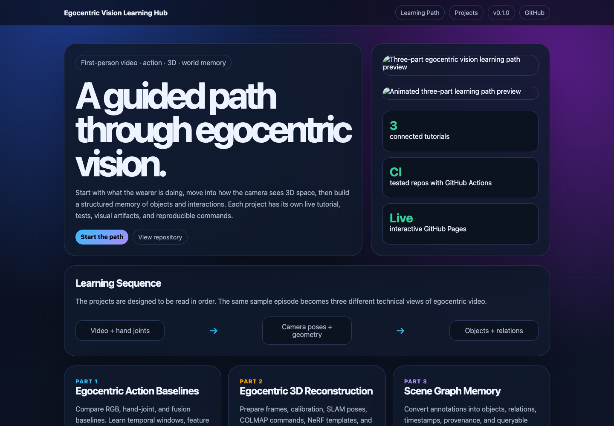

# Egocentric Vision Learning Hub

An interactive learning path for three first-person vision demos built around
one Xperience-10M pour-over coffee episode.

Short walkthrough recording: [`docs/assets/walkthrough.webm`](docs/assets/walkthrough.webm)

## Start Here

Open the hub:

- Web page: https://chaoyue0307.github.io/egocentric-vision-learning-hub/
- Unified glossary: https://chaoyue0307.github.io/egocentric-vision-learning-hub/glossary.html
- Project narrative: https://chaoyue0307.github.io/egocentric-vision-learning-hub/article.html
- Portfolio summary: [`PROJECT_SUMMARY.md`](PROJECT_SUMMARY.md)

The sequence is:

1. **Action understanding:** recognize what the wearer is doing.
2. **3D reconstruction:** prepare frames, calibration, SLAM poses, and rendering commands.
3. **Scene graph memory:** turn video annotations into queryable object and relation memory.

## Capstone: From Pixels To World Memory

[`notebooks/capstone_pixels_to_world_memory.ipynb`](notebooks/capstone_pixels_to_world_memory.ipynb)
connects all three stages on the same episode — and runs entirely from the
sibling repos' **committed artifacts**, so no raw dataset download is needed.
Clone the four repos into one parent directory and run it top to bottom. It
shows the same model spanning 0.004→0.941 accuracy purely from split design,
the empirically-verified extrinsic chain behind the hand masks, and the
"where did I last see the kettle?" spatial-memory query, then ties the three
stages together: hands are the through-line of egocentric vision.

The glossary page merges all three project glossaries (33 concepts) with
anchors and source links; regenerate it with `python scripts/build_glossary.py`
after editing any sibling `docs/concepts.md`.

## Projects

| Project | Webpage | Repository |
| --- | --- | --- |
| Egocentric Action Baselines | https://chaoyue0307.github.io/egocentric-action-baselines/ | https://github.com/ChaoYue0307/egocentric-action-baselines |
| Egocentric 3D Reconstruction Demo | https://chaoyue0307.github.io/egocentric-3d-reconstruction-demo/ | https://github.com/ChaoYue0307/egocentric-3d-reconstruction-demo |
| Scene Graph From Egocentric Video | https://chaoyue0307.github.io/scene-graph-from-egocentric-video/ | https://github.com/ChaoYue0307/scene-graph-from-egocentric-video |

Raw dataset files are not included in this hub. Each project explains its own
minimal data contract.
